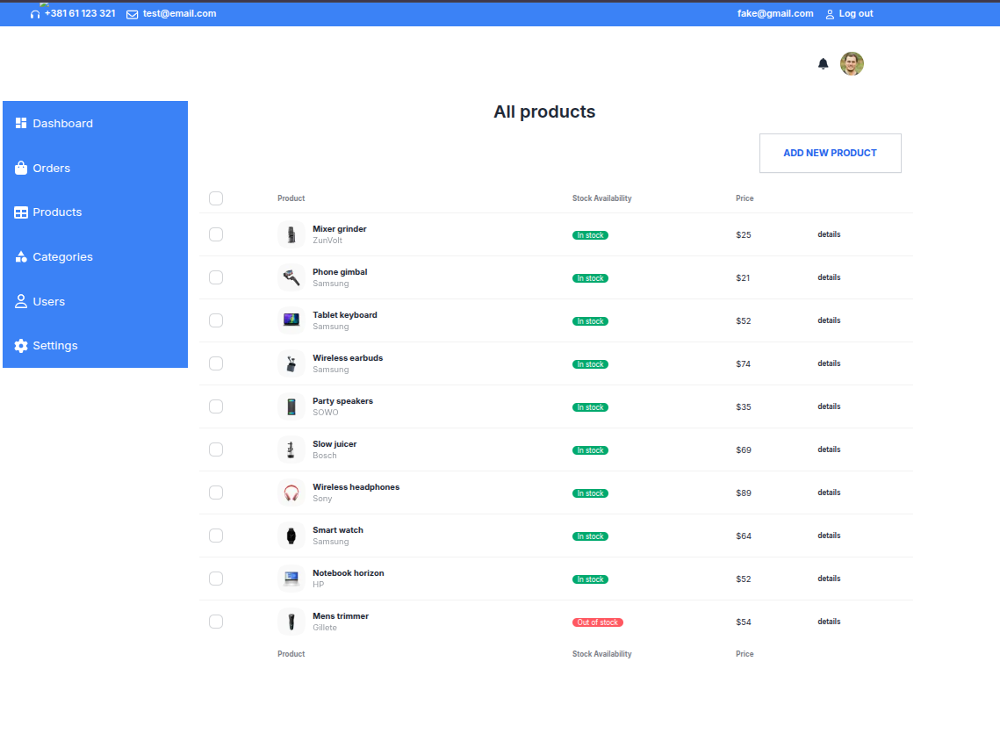
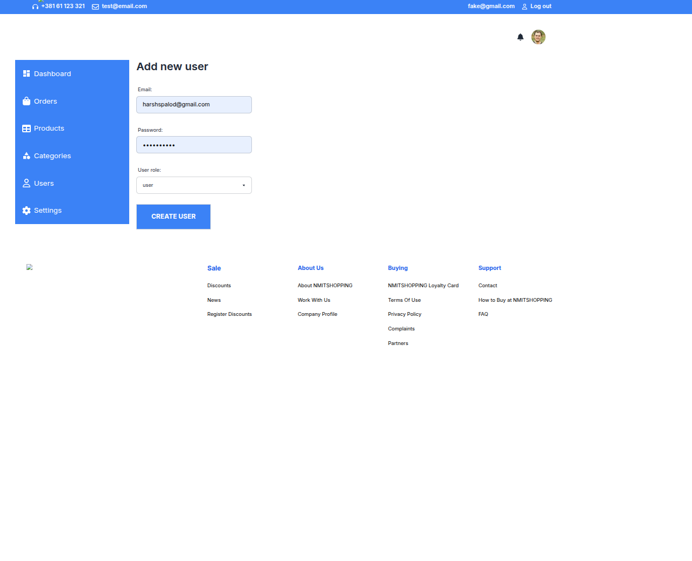

# 🛍️ NMIT Shopping

A full-stack eCommerce web app with an **Admin Panel** – built using **Next.js, Express.js, Prisma, and SQLite**.

NMIT Shopping is a mini-OLX style marketplace where users can **browse, list, and purchase products**.  
It includes a **public shop**, **authentication system**, **cart & checkout**, and an **admin dashboard** for managing products, categories, users, and orders.


## ✨ Features

### 👤 User
- 🔑 Register / Login  
- 🛒 Browse products with search & category filters  
- 📄 View product details with price, description, and seller info  
- 🛍️ Add to cart & checkout (demo)  
- ❤️ Wishlist  
- 👤 Profile: manage listings, orders, and saved items  

### 👨‍💼 Admin
- 📊 Dashboard overview (users, products, orders)  
- 🛠️ Manage products (approve, edit, delete)  
- 📂 Manage categories  
- 👥 Manage users (promote, block)  
- 📦 Manage orders  

---

## ⚡ Tech Stack
- **Frontend:** Next.js 14 (App Router), TailwindCSS, DaisyUI  
- **Backend:** Express.js REST API  
- **Database:** SQLite (Prisma ORM)  
- **Auth:** NextAuth.js  

---

## 🚀 Quick Start

### 1. Requirements
- Node.js 18+  
- npm  

### 2. Clone & Install
```bash
git clone <repo-url>
cd nmit-shopping
npm install
````

### 3. Environment Setup

Create `.env` in project root:

```env
DATABASE_URL="file:./prisma/dev.db"
NEXTAUTH_URL=http://localhost:3000
NEXTAUTH_SECRET=replace_with_long_random_string
NEXT_PUBLIC_API_BASE_URL=http://localhost:3001
```

Create `server/.env`:

```env
DATABASE_URL="file:./dev.db"
PORT=3001
```

### 4. Database Init

```bash
cd server
# clean old migrations if switching from MySQL
mkdir -p prisma/_backup && mv prisma/migrations prisma/_backup/ 2>/dev/null || true
rm -f prisma/migration_lock.toml

# push schema to SQLite
npx prisma db push --force-reset
npx prisma generate
```

### 5. Seed Demo Data

Create `server/prisma/seed.js`:

```js
const { PrismaClient } = require('@prisma/client');
const bcrypt = require('bcryptjs');
const prisma = new PrismaClient();

async function main() {
  const passwordHash = await bcrypt.hash('admin123', 10);

  // Admin
  await prisma.user.upsert({
    where: { email: 'admin@nmit.com' },
    update: { role: 'ADMIN', password: passwordHash },
    create: {
      email: 'admin@nmit.com',
      username: 'admin',
      password: passwordHash,
      role: 'ADMIN',
    },
  });

  // User
  await prisma.user.upsert({
    where: { email: 'user@nmit.com' },
    update: {},
    create: {
      email: 'user@nmit.com',
      username: 'demo',
      password: await bcrypt.hash('user123', 10),
      role: 'USER',
    },
  });

  // Category & Product
  const electronics = await prisma.category.upsert({
    where: { name: 'Electronics' },
    update: {},
    create: { name: 'Electronics' },
  });

  await prisma.product.create({
    data: {
      title: 'Sample Laptop',
      slug: 'sample-laptop',
      description: 'A demo laptop product',
      price: 49999,
      categoryId: electronics.id,
    },
  });

  console.log('✅ Demo data inserted');
}
main().then(() => prisma.$disconnect());
```

Run it:

```bash
cd server
node prisma/seed.js
```

### 6. Run Servers

Backend:

```bash
cd server
node app.js
```

Frontend:

```bash
npm run dev
```

Open: [http://localhost:3000](http://localhost:3000)

---

## 👥 Demo Users

| Role  | Email                                   | Password |
| ----- | --------------------------------------- | -------- |
| Admin | [admin@nmit.com](mailto:admin@nmit.com) | admin123 |
| User  | [user@nmit.com](mailto:user@nmit.com)   | user123  |

---

## 📡 API Endpoints (Backend – Express.js)

### Products

* `GET /api/products` → list all products
* `GET /api/products/:id` → get product details
* `POST /api/products` → create product (auth required)
* `PUT /api/products/:id` → update product
* `DELETE /api/products/:id` → delete product

### Categories

* `GET /api/categories`
* `POST /api/categories` (admin)

### Users

* `GET /api/users` (admin)
* `POST /api/register`
* `POST /api/login`

### Orders

* `GET /api/orders` (admin)
* `POST /api/orders` (user checkout)

## 📸 Screenshots

> A quick tour of NMIT Shopping across the public shop, user selling flow, cart/checkout, and admin panel.

---

### 🛍️ Public Storefront

| Screenshot | Caption |
|---|---|
|  | **Home:** Featured listings and quick entry to categories. |
|  | **Categories:** Browse by category with filters. |
|  | **Product List:** Grid view with names, prices, and quick actions. |
|  | **Product Details:** Title, price, description, and seller info. |

---

### 🔐 Auth

| Screenshot | Caption |
|---|---|
|  | **Register:** Create an account to buy/sell. |
|  | **Login:** NextAuth.js powered sign-in. |

---

### 🧑‍💼 User — Sell & Manage

| Screenshot | Caption |
|---|---|
|  | **Dashboard (User):** Shortcut to add/manage your listings. |
|  | **Add Product:** Create a new listing with title, price & category. |
|  | **Update Product:** Edit listing details (title, price, description, etc.). |

> _Note:_ `addprod.png` / `upprod.png` are the seller-facing forms for used items.

---

### 🛒 Cart & Checkout

| Screenshot | Caption |
|---|---|
|  | **Cart:** Review selected items and totals. |
|  | **Checkout (Demo):** Place order flow for test transactions. |

---

### 🛠️ Admin Panel

| Screenshot | Caption |
|---|---|
|  | **Products (Admin):** Review, approve, edit, or delete products. |
|  | **Add Category:** Create new product categories. |
|  | **Update Category:** Edit existing categories. |
|  | **Users:** View/promote/block users. |
|  | **Add User:** Create admin or regular accounts. |
|  | **Orders:** Track and manage all orders across the platform. |

---

### 🧭 Tips for Best Display
- Keep image filenames and paths exactly as shown (`./screenshots/...`).
- Use 1280×720 (or similar) for crisp previews in GitHub.
- If images are too large, consider compressing with TinyPNG before committing.


## ⚠️ Troubleshooting

* **Error:** `URL must start with mysql://` → Some schema still has `provider = "mysql"`. Change all to `"sqlite"` and run `npx prisma db push`.
* **P3019 Migration error** → Delete old migrations + `migration_lock.toml`.
* **Fetch failed from frontend** → Ensure backend is running at `http://localhost:3001` and `NEXT_PUBLIC_API_BASE_URL` is set correctly.

---

## 📜 License

MIT License – free to use and modify.

---

## 📊 Architecture Flow (Mermaid)


👉 NMIT Shopping – a complete full-stack project with SQLite, demo users, endpoints, and a seed script.

```

---
Video link
```
